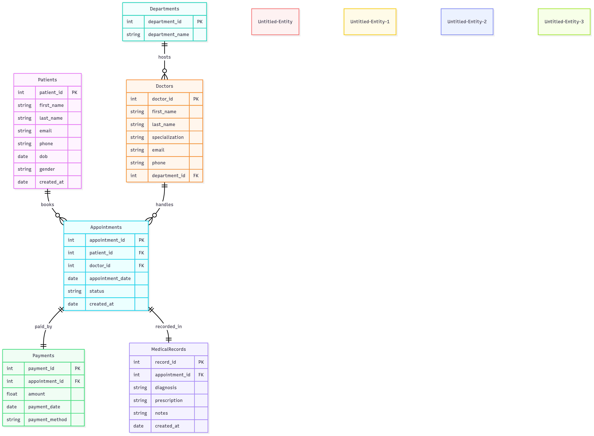

# 🌸🏥 Clinic Booking System 💖

This project allows managing of **patients, doctors, appointments, departments, payments, and medical records** in a clean and organized way.  

---

## 📊 ER Diagram

<p align="center">
  
</p>

*Our database design is visualized above. It shows how patients, doctors, appointments, departments, payments, and medical records are connected! 💖*

---

## ✨ Mermaid ER Diagram (optional interactive)

```mermaid
erDiagram
    Patients {
        int patient_id PK
        string first_name
        string last_name
        string email
        string phone
        date dob
        string gender
        date created_at
    }

    Departments {
        int department_id PK
        string department_name
    }

    Doctors {
        int doctor_id PK
        string first_name
        string last_name
        string specialization
        string email
        string phone
        int department_id FK
    }

    Appointments {
        int appointment_id PK
        int patient_id FK
        int doctor_id FK
        date appointment_date
        string status
        date created_at
    }

    Payments {
        int payment_id PK
        int appointment_id FK
        float amount
        date payment_date
        string payment_method
    }

    MedicalRecords {
        int record_id PK
        int appointment_id FK
        string diagnosis
        string prescription
        string notes
        date created_at
    }

    Patients ||--o{ Appointments : "books"
    Doctors  ||--o{ Appointments : "handles"
    Departments ||--o{ Doctors : "hosts"
    Appointments ||--|| Payments : "paid_by"
    Appointments ||--|| MedicalRecords : "recorded_in"
